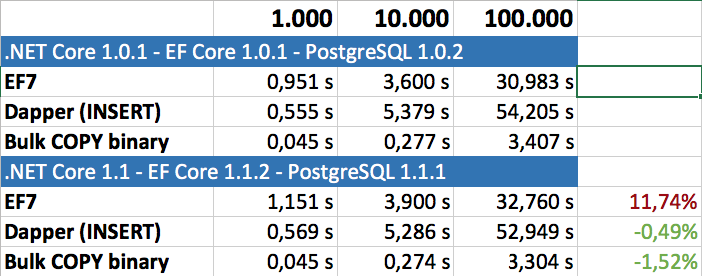

# dotnet-postgres

Test bulk insert

 - Entity Framework Core
 - Dapper
 - Npgsql COPY

create user 'test' (password 'test') on postgres
create database 'test' on postgres
dotnet ef database update
dotnet run

## results

